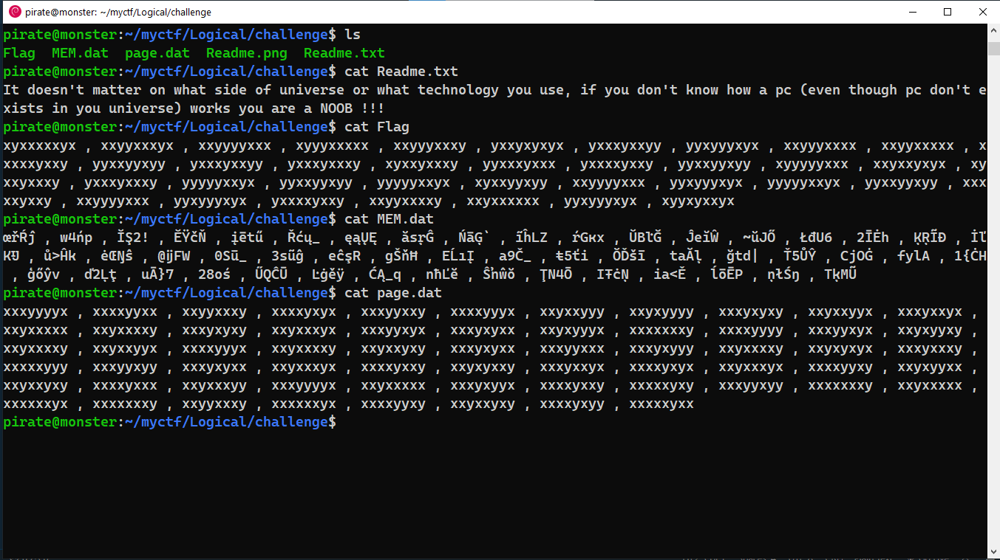
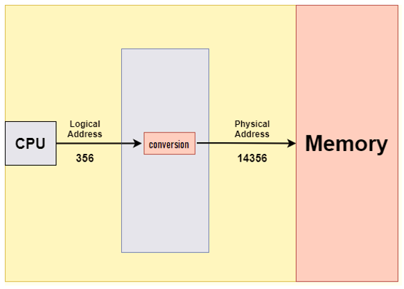
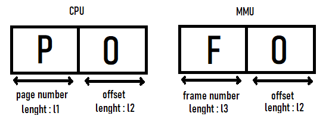
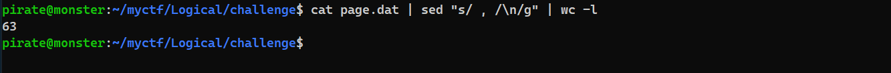
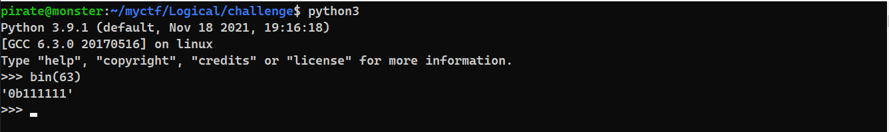

# Introduction
---
Ok so after unziping the challenge we can see 4 main files

File 1 , 2 and 3 : Flag , MEM.dat and page.dat<br><br>

<br><br><br><br>
File 4 : Readme.png<br><br>


- **Flag**
    - There are some random `x` and `y` of lenght 9 seperated by ` , `

- **Readme.png**
    - This looks like the mapping of logical address to physical address which is done by Memory Management Unit (MMU)

- **MEM.dat**
    - Contains group of characters of lenght 4 seperated by ` , `
    - And as we have seen in Readme.png, maybe mem means memory

- **page.dat**
    - There are some random `x` and `y` of lenght 8 seperated by ` , `
    - Maybe page means the page table/file use in MMU

---
# BUT HOW DOES MMU WORK
So as we all know that CPU is a Processing Unit and runs instructions inorder to run a program. Now to run an instruction cpu calls it by referencing it's address (where it is stored), but CPU doesn't know where it is stored so CPU sends a `query/data` (Logical address) to MMU and then MMU converts it to physical address using a `page table` (the actual location of instruction) and fetchs the instruction. 

Now the the data send by CPU to MMU and MMU conversion looks like this<br>


So every process is divied into few or million pages with a starting address of 0x0 and as there are many processes running in background not every process can have a starting address of 0x0 (each process is stored in different location)

So to convert that 0x0 to an actual address we have MMU that use the page table to identify the real address

`One thing you we can notice in above pic is that the lenght of offset is same in CPU and MMU data`

To go on more detail on this use this [link]()

---
# Cracking Analysis
The ctf have some corelation with working of MMU so might be that the flag is logical address and using MMU we have to convert it to the Flag format

Tthe first part of the flag `xyxxxxxyx` should correspond to `F` as the format of flag is `FLAG{..}`

1. So, Maybe `x` and `y` are bit ( 1, 0 ) **but which one is which ?** *For that we have to do Trial n Error*
1. We need to find how much bit are for **Page number** and **Offset**

    - For that we need to apply a simple logic ie. the page number section generated by cpu is gonna store the indices of the page table, so the max. number in page number section will be the last index number of page table. To know that we need to run a small bash script<br><br>
    ```bash
    cat page.dat | sed "s/ , /\n/g" | wc -l
    ```
    
    <br>

    - The total page Entries are 64 but the it's index will be 63 as the counting starts from 0. So, the required bits for page section will be 6-bits <br><br>

    

---
# Finding x and y
`xyxxxxxyx` this should be equal to `F` as discused above and it's six bits `xyxxxx` are page Number index and last 3 `xyx` are offset

if we assume that<br>
| y and x  | bits |
| --- | --- |
| y  | 0  |
| x  | 1  |

and do a manual traversing than we would found a character other than `F`<br>
This means that the actual table would be<br>
| y and x  | bits |
| --- | --- |
| y  | 1  |
| x  | 0  |

---
# Cracking
Now after learning how the obfuscation is working **LET'S CREATE HACKING SCRIPT**

```python
import os
# os.chdir("Logical/challenge")

with open("Flag","r") as f:
    flag=f.read().replace(" \n","").replace("x","0").replace("y","1").split(" , ")

with open("page.dat","r") as f:
    page=f.read().replace("\n","").replace("x","0").replace("y","1").split(" , ")

with open("MEM.dat","rb") as f:
    mem=f.read().replace(b"\n",b"").split(b" , ")

# converting mem (bytes) to mem2 (string/char)
mem2 = []
for i in mem:
    mem2.append(i.decode())

# Flag loop
for i in flag:
    p = int(i[:6],2)
    o = int(i[6:],2)
    f = int(page[p],2)
    c = mem2[f][o]
    # print(p,f,o,c)
    print(c,end="")
print()

```


