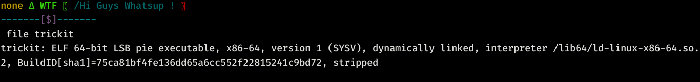
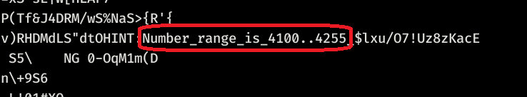
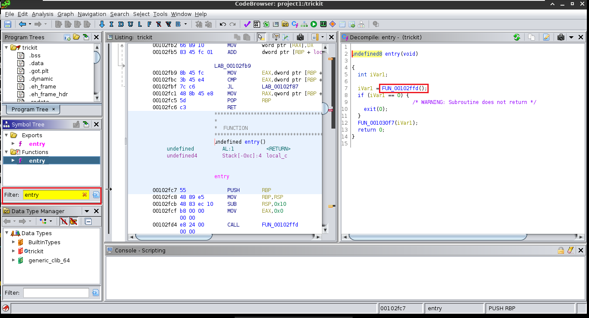
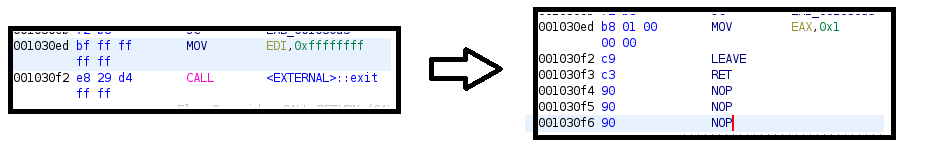
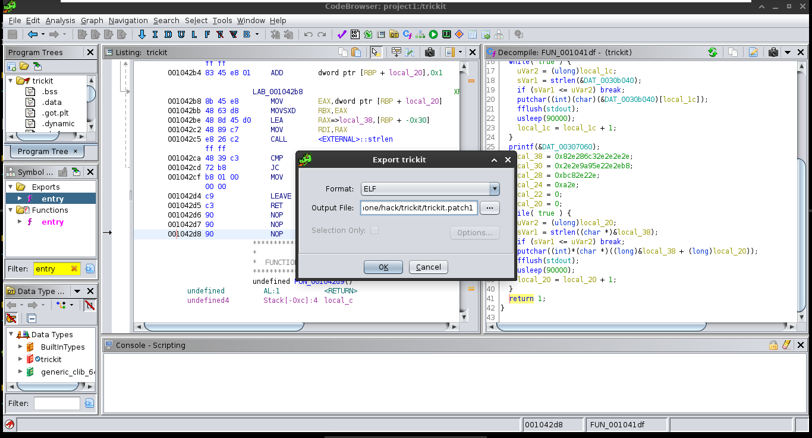
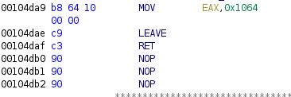

# Introduction
<br>

```bash
strings trickit
```
<br>
This is the xor number range

# Patching Binary
Open Ghidra or Some other tool for binary patching

<br>
- Find the entry function, then enter into the 1st function call
- Patch the last two call/opcodes ie. `mov` and `call` ( In Ghidra press `Ctrl + Shift + G` ) to this<br><br>
<br><br>

Then export the program in Elf Format ( In Ghidra press `O` )

<br>

Then run the patched program and grab the hexdigits

Make a python xor brute forcing script the range is from `4100 to 4255`

```python
a=r"\x101e\x1019\x101f\x1008\x101e\x101e\x1008\x1009\x1010\x105d\x100f\x105f\x1018\x1009\x1032\x105c\x100f\x1018\x105f\x1009\x1032\x100c\x100f\x100f\x1018\x105f\x105e\x1021\x1032\x100c\x100f\x100f\x105c\x1018\x103a\x1016\x100a\x100c\x1001\x102b\x106d\x121".replace("\\x"," ").split()
flag=""

for i in range(4200,4255):
    flag = "".join([chr(int(x,16)^i^5) for x in a])
    if "stressed" in flag:
        # print(flag[::-1])
        print(i)
```
We get **`4200`** output from the script


Again patch the binary and replace the `eax` value ( that we last change to `0x1` ) to `4200 - 4 =`**`0x1064`**<br><br>


*Now save this patch and run it*
*You will get your flag* :wink:

